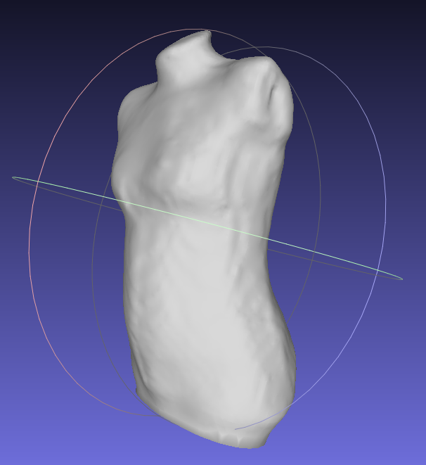

# ScanningFusion-From-Camera-Capture-to-3D-Model
This is a set of bin files, merging several images captured by Realsense D4XX to Merged Point cloud

# System Requirements

- Windows 10 64 bit 

  

# Program details

## Image Conversion

- This bin file will convert image from png to ppm or pgm (fusion program requests this format)

- First, you need to get images from Camera (recommend Realsense D415 and D435(I)).

  - Color Stream: 640 X 480 (Using OpenCV to convert to CV_8UC3 image)

  - Depth Frame: 640 X 480 (Using OpenCV to convert to CV_16UC1 image)

  - Output file name: file name should range from 000000.png to 999999.png

  - If you have any question, plz contact tianyj1997@163.com

    

- Run ./Image_Conversion/ShapeLab.exe 

  - using cmd to run it:  ShapeLab help

    This will output clear information about how to use it

    

## Camera Calibration

- Calibrate Realsense D4XX
  - See ./Calib/bin/README.me for details
  - We provide chess.pdf in ./Calib/bin/ to automatically calibrate camera and calibration program will provide output txt file which can be directly read from Fusion exe file
  - Remark: This bin file is from https://github.com/carlren/OpenNICalibTool

## RGB-D data fusion

- move the converted ppm and pgm files to ./infiniTAM_cli_bin/rgb_ppm and ./infiniTAM_cli_bin/depth_pgm.
- Fusion result will be stored in ./infiniTAM_cli_bin/FusionResult
- Use cmd to run ./infiniTAM_cli_bin/infiniTAM_cli.exe 
  - cmd format is in cmd_example.txt 
  - You should replace Calib_ITM_D415.txt with the generated file from ***Camera Calibration***

 

## Result 

- This result has been post-processed in MESHLAB

